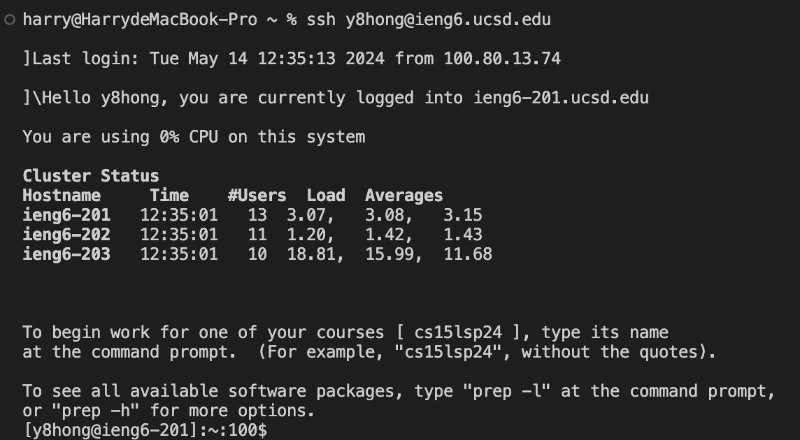
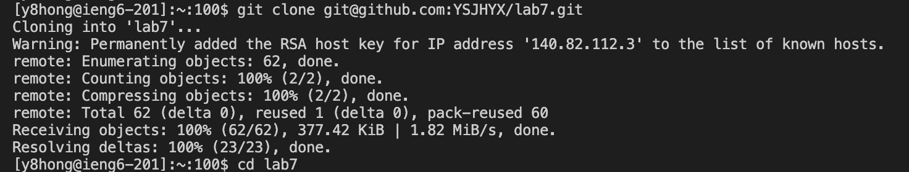
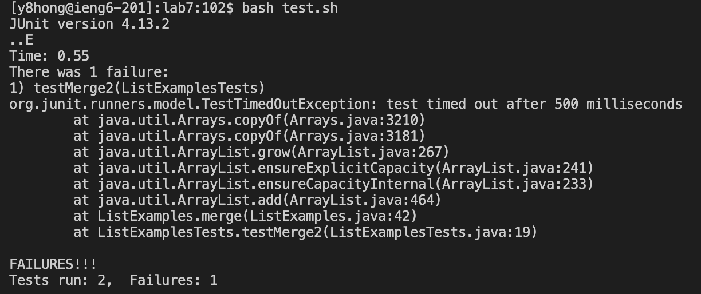
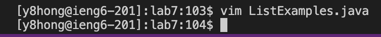
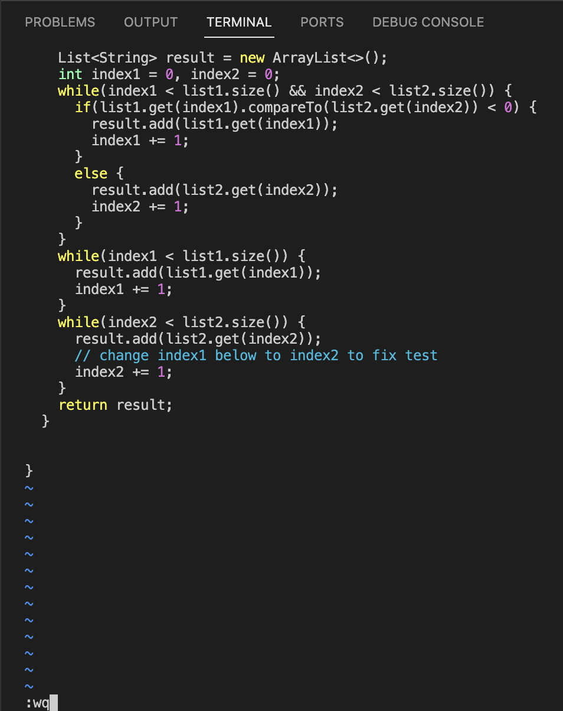
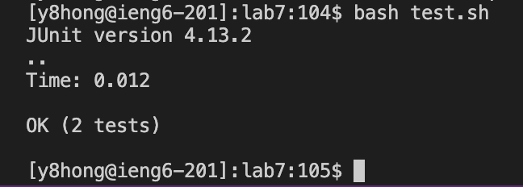

# Lab Report 4 (Vim)

## Step 4:

`ssh<space>y8hong@ieng6.ucsd.edu`, `<enter>`

For this step, I entered the command `ssh` with my login account name in the terminal to log into ieng6. After I pressed `<enter>`, it completed login automatically since I have logged into it before.

## Step 5:

`git<space>clone<space>git@github.com:YSJHYX/lab7.git`, `<enter>`
`cd lab7`, `<enter>`

For this step, I entered the command `git clone` with the `SSH` URL for the folk of the repository from my GitHub account, then pressed `<enter>` to complete the cloning step, which clones it into `lab7` directory. Also, in order to do the next step, I changed my current working directory to `lab7` by using `cd lab7` and pressing <enter>.

## Step 6:

`bash<space>test.sh`, `<enter>`

In this step, I entered the command `bash<space>test.sh`, and then pressed `<enter>` to run the tests, demonstrating that they failed.

## Step 7:

`vim<space>ListExamples.java`, `<enter>`

In the first part of this step, I entered `vim<space>ListExamples.java` and pressed `<enter>` to enter the `vim` editor.

`i`, `2`, `esc`,`:wq`

In the second part of step 7, I scrolled down to find the error. Then, I pressed `i` to enter the insert mode, moving the cursor to the space behind the `1` in `index1` and changing it to `2`. After correcting, I pressed `esc` to exit insert mode and typed `:wq` with <enter> to quit with saving.

## Step 8:

Using the up arrow to find `bash<space>test.sh` command, `<enter>`

In this step, instead of typing in the full command, I used the up arrow to access my bash history to find `bash<space>test.sh`. After finding the expected command, pressed `<enter>` to run the tests, demonstrating that they now succeed.
