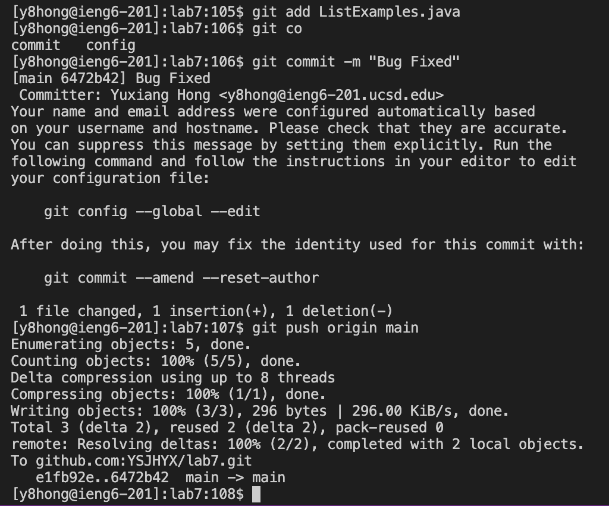

# Lab Report 4 (Vim)

## Step 4:

`ssh<space>y8hong@ieng6.ucsd.edu`, `<enter>`

For this step, I entered the command `ssh` with my login account name in the terminal to log into ieng6. After I pressed `<enter>`, it completed login automatically since I have logged into it before.

## Step 5:

`git<space>clone<space>git@github.com:YSJHYX/lab7.git`, `<enter>`

`cd<space>lab7`, `<enter>`

For this step, I typed the command `git clone` with the `SSH` URL for the folk of the repository from my GitHub account, then pressed `<enter>` to complete the cloning step, which clones it into `lab7` directory. Also, in order to do the next step, I changed my current working directory to `lab7` by using `cd lab7` and pressing <enter>.

## Step 6:

`bash<space>test.sh`, `<enter>`

In this step, I typed the command `bash<space>test.sh`, and then pressed `<enter>` to run the tests, demonstrating that they failed.

## Step 7:

`vim<space>ListExamples.java`, `<enter>`

In the first part of this step, I typed `vim<space>ListExamples.java` and pressed `<enter>` to enter the `vim` editor.

`<down>`, `i`, `2`, `esc`,`:wq`

In the second part of step 7, instead of using other commands, I used the `<down>` arrow to scroll down to find the error. Then, I pressed `i` to enter the insert mode, moving the cursor to the space behind the `1` in `index1` and changing it to `2`. After correcting, I pressed `esc` to exit insert mode and typed `:wq` with <enter> to quit with saving.

## Step 8:

Using the `<up>` arrow to find `bash<space>test.sh` command, `<enter>`

In this step, instead of typing in the full command, I used the `<up>` arrow to access my bash history to find `bash<space>test.sh`. After finding the expected command, I pressed `<enter>` to run the tests, demonstrating that they now succeed.

## Step 9:

`git<space>add<space>ListExamples.java`, `<enter>`

`git<space>commit<space>-m<space>"Bug<space>Fixed"`, `<enter>`

`git<space>push<space>origin<space>main`, `<enter>`

In the final step, in order to commit and push the resulting change to my GitHub account, I first typed `git<space>add<space>ListExamples.java`, then pressed `<enter>` to add the file `ListExamples.java` to the staging area, preparing it for a commit. Then I typed `git<space>commit<space>-m<space>"Bug<space>Fixed"` to commit the current changes with a message of "Bug Fixed", and after pressing <enter>, the command was executed. Finally, I typed `git<space>push<space>origin<space>main` to push the local changes to my GitHub, after pressing <enter>, the command was executed and the whole process was completed.
